# HW2: Terraform, Docker, and the Limits of In-Memory State

## Layout

| Path | What it is |
|---|---|
| `terraform/main.tf` | EC2 instance(s) + security group (SSH and port 8080 from my IP only) + AL2023 AMI lookup |
| `terraform/terraform.tfvars` | My IP / key-pair name. **Not committed** (in `.gitignore`); submitted on Canvas only |
| `docker/Dockerfile`, `docker/main.go` | Gin albums API, packaged with a multi-stage build |
| `part4.py` | Script that GETs both instances, POSTs to instance 2, then GETs both again |
| `screenshots/` | Evidence for each part |

## Part I: MapReduce review

Posted on Piazza as a Note in the hw2 folder.

## Part II: Terraform

`terraform init` → `terraform apply` → SSH in → `terraform destroy`.

| | |
|---|---|
| Instance **Running** in the EC2 console | 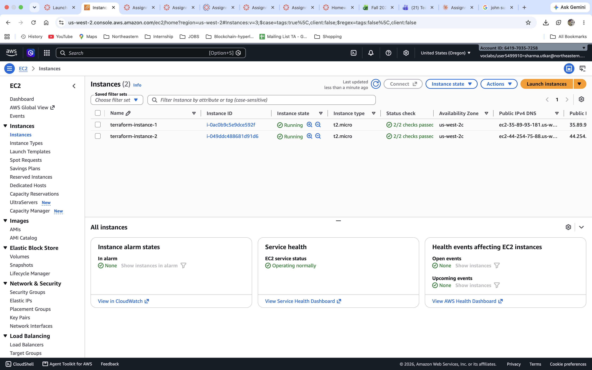 |
| `terraform destroy` complete (2 resources destroyed) | 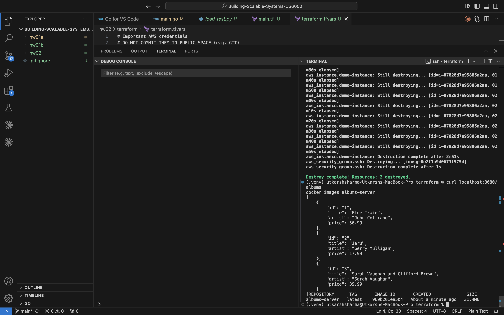 |
| Console confirms the instance is **Terminated** | 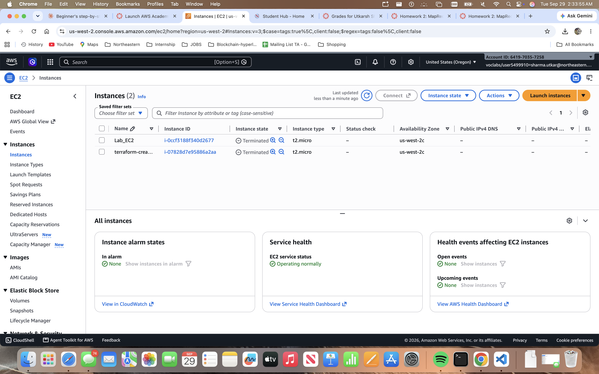 |

## Part III: Docker

Built and ran the image locally, then cloned the repo onto a Terraform-created EC2 instance and built and ran it there.

- **Local:** the build took 16.1s, and the final image is **31.4 MB**. `curl localhost:8080/albums` returns the three albums.
  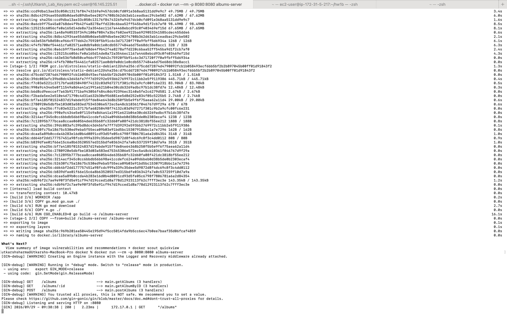
- **EC2:** installed git, added 2 GB of swap, cloned, built, and ran. The Go compile step took **408s** on the t2.micro (1 vCPU, 1 GiB RAM), compared with 16s on my Mac:
  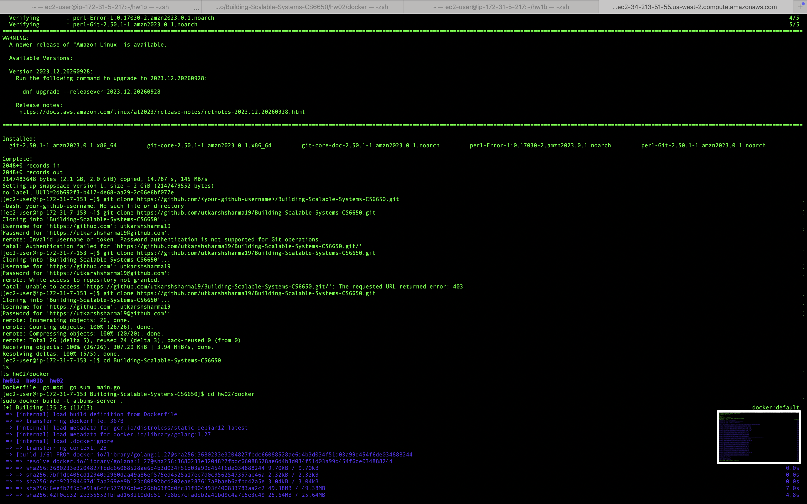
  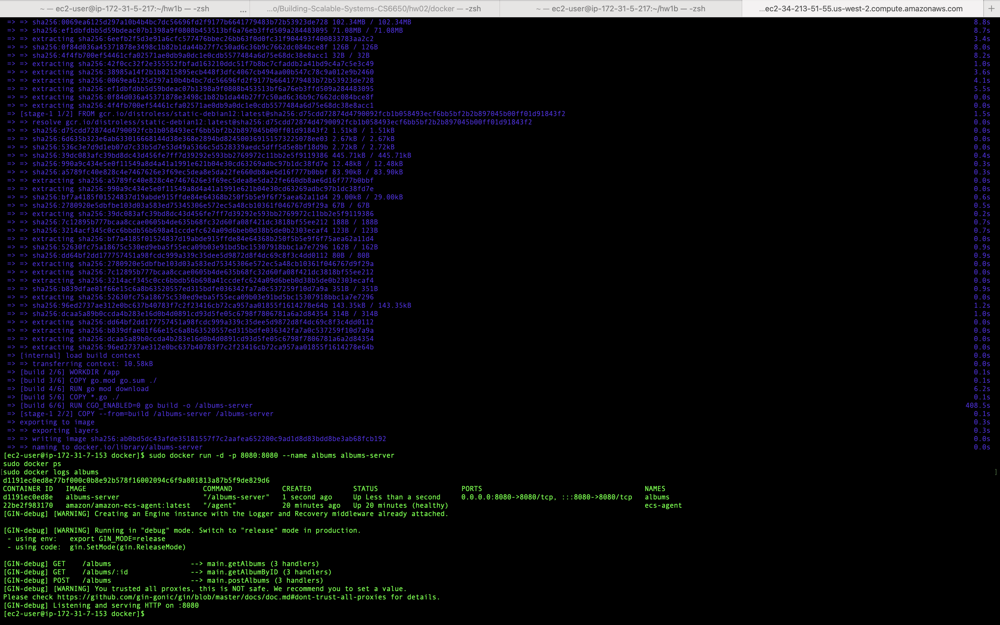
- **Reached from my Mac** at `http://34.213.51.55:8080/albums`:
  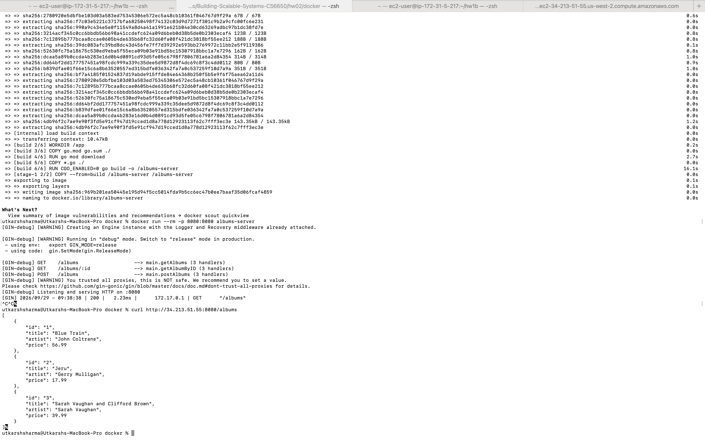

**Why EC2 never needed Go installed:** the Dockerfile is multi-stage. The `golang:1.27` stage compiles a static binary (`CGO_ENABLED=0`). The final stage is `distroless/static-debian12` with only that binary copied in. Docker was already on the box because the AMI filter matched an ECS-optimized Amazon Linux 2023 image (note the `amazon-ecs-agent` container in `docker ps`). The AMI packages the whole machine, and the image packages only the app.

## Part IV: Two instances

Added `count = 2` to the instance resource and switched the outputs to splat form (`aws_instance.demo-instance[*].public_ip`). Terraform kept the existing instance as `demo-instance[0]` and added `[1]`, giving "1 added, 1 changed, 0 destroyed":

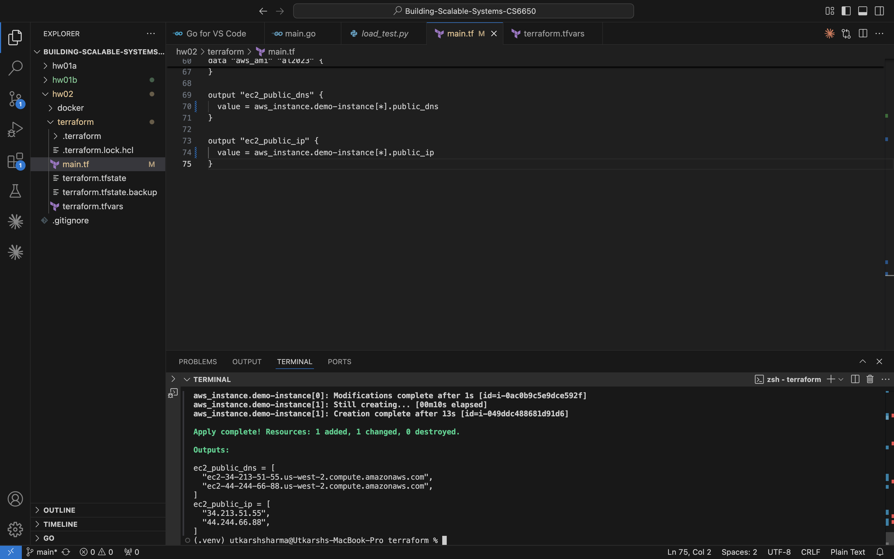

Both instances served the same three albums before the test:

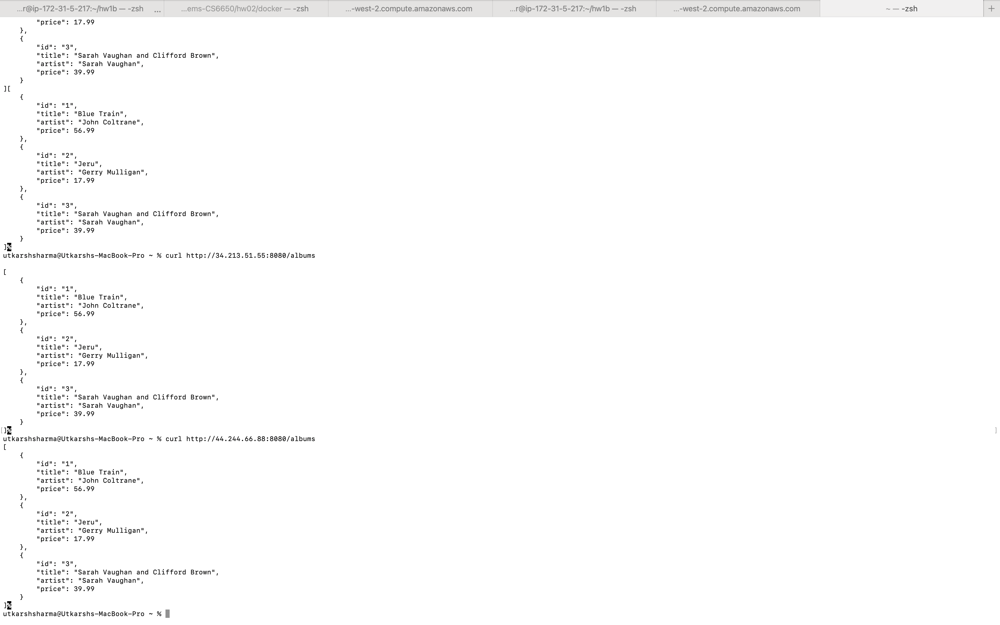

Running `part4.py`, which POSTs album 4 to instance 2 only:

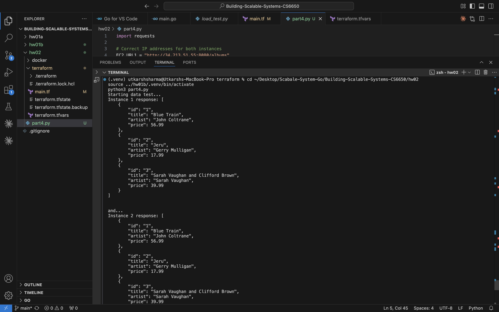
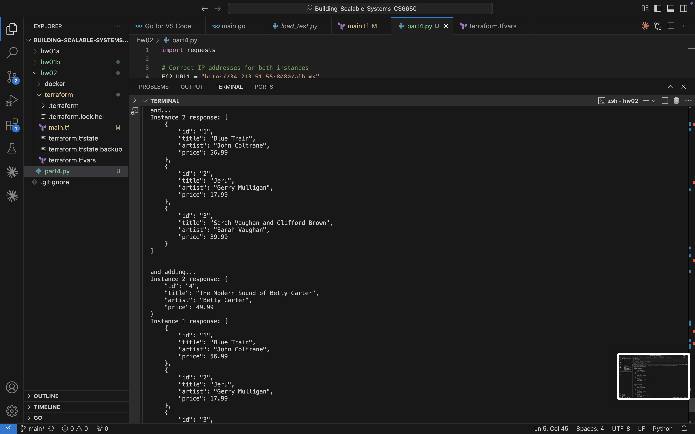
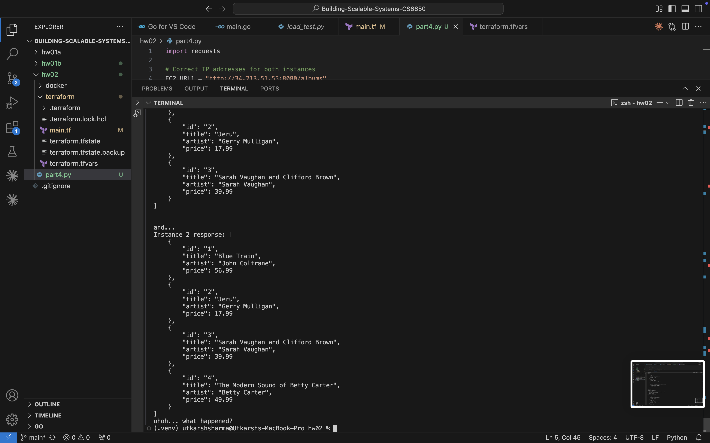

### What happened?

Each EC2 instance runs its own independent copy of the server, and the album "database" is just a Go slice in that process's memory. The POST went to instance 2, so only instance 2's slice gained album 4. Instance 1 never heard about it, and the two copies now disagree. The data is also not durable: restarting either container (or the instance) resets it to the three hard-coded albums. If a load balancer were in front of these two boxes, a client could write to one, have the next read routed to the other, and conclude their data was lost. Scaling out therefore needs stateless application servers backed by a shared data store, or replication between the nodes. Replication brings its own problems: keeping copies consistent, handling concurrent writes, and deciding what a reader should see while an update is still propagating.

### Cleanup

Ran `terraform destroy -auto-approve` (3 resources: both instances and the security group). The console confirms both instances are terminated:

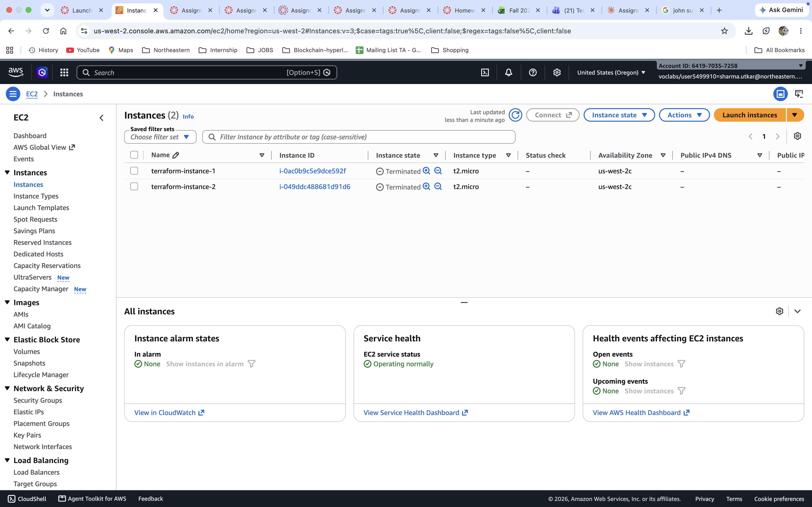
