# HW3: Threading and Load Tests

All runs were on an Apple M1 (8 cores), Go 1.27.1. Docker Desktop was limited to 4 CPUs and 3.8 GiB, and Locust was 2.46.7.

| Part | Where |
|---|---|
| I: Lamport, *Time, Clocks, and the Ordering of Events* | Piazza note, hw3 folder |
| II: thread experiments | [`part2/`](part2), screenshots `p2-*` |
| III: Locust load tests | [`part3/`](part3), screenshots `p3-*` |
| IV: concurrent server design | [`part4/DESIGN.md`](part4/DESIGN.md), screenshots `p4-*` |

---

## Part II: Thread experiments

Run any experiment from `hw03/` with `go run ./part2/<name>`.

### Atomicity: `part2/atomic`

50 goroutines each increment two counters 1,000 times, so both should end at 50,000.

| Counter | Result over 10 runs |
|---|---|
| `atomic.Uint64.Add` | 50,000 every run |
| plain `uint64++` | 11,614 – 19,303. **Wrong in 10/10 runs**, losing 30,697 – 38,386 updates |

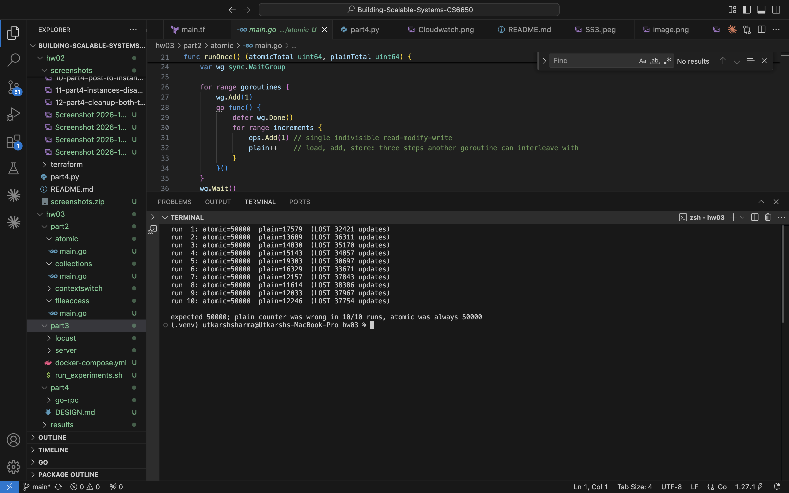

**What's happening:** `plain++` is three steps: load, add, store. Two goroutines can both load 41, both add 1, and both store 42, so one increment is lost. On 8 cores this happens constantly, which is why we lost 60–77% of updates, not just a few. `atomic.Add` is a single indivisible read-modify-write instruction (`LDADD` on ARM64), so no interleaving can split it.

**`go run -race`** builds with the race detector, which tracks every memory access and reports two goroutines touching the same address without synchronization when at least one is a write. It pointed straight at `main.go:32` (`plain++`), reported `Found 2 data race(s)`, and exited with status 66. It never flagged the atomic counter.

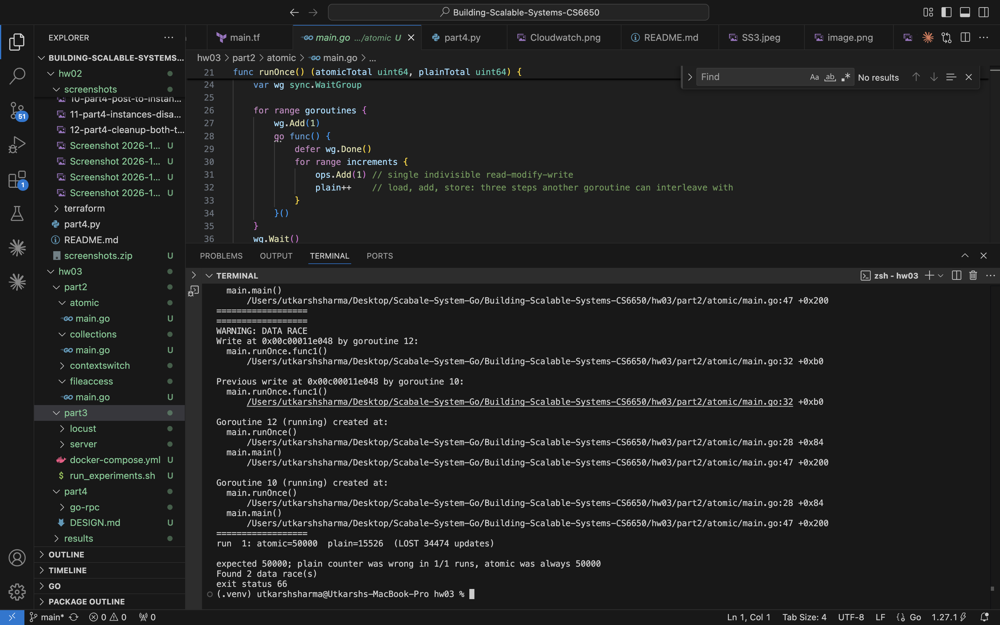

**Concept:** an operation is only safe to share across threads if it's atomic, or if it's protected so that it behaves atomically. "Usually works" is not correct. The race detector finds the bug even in runs where the final number happens to be right.

### Collections: plain map, Mutex, RWMutex, sync.Map (`part2/collections`)

50 goroutines × 1,000 writes of `m[g*1000+i] = i`, so 50,000 distinct keys.

**Plain `map[int]int`:** it crashed in 3/3 runs with `fatal error: concurrent map writes`.

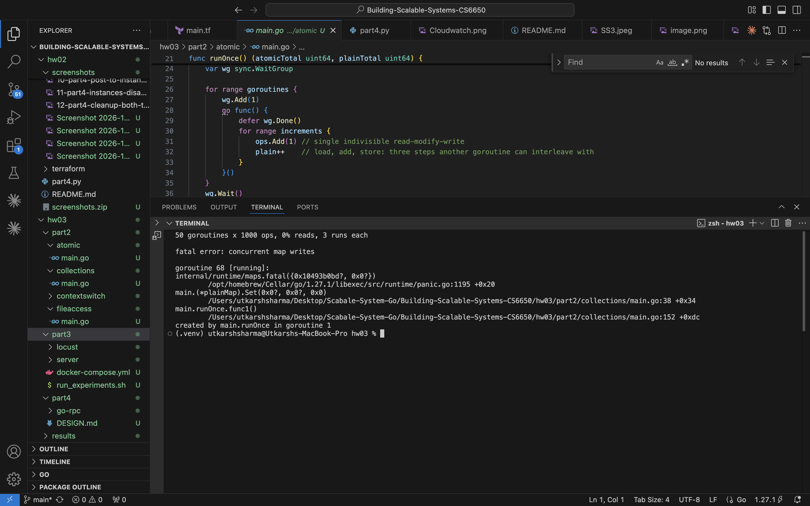

A Go map is a hash table that grows and moves its buckets as it fills. A concurrent write during a resize could corrupt it silently, so the runtime keeps a "writing" flag and **deliberately kills the process** when it sees two writers at once. That's a fail-fast design: crashing is better than returning wrong data. It's also a `fatal error`, not a `panic`, so it can't be recovered.

**Wrapped versions, mean of 3 runs:**

| | Write-only (len) | Write-only (time) | 90% reads (time) |
|---|---|---|---|
| `map` + `sync.Mutex` | 50,000 | **8.47 ms** | 5.90 ms |
| `map` + `sync.RWMutex` | 50,000 | **8.53 ms** | 3.31 ms |
| `sync.Map` | 50,000 | **3.91 ms** | 2.09 ms |

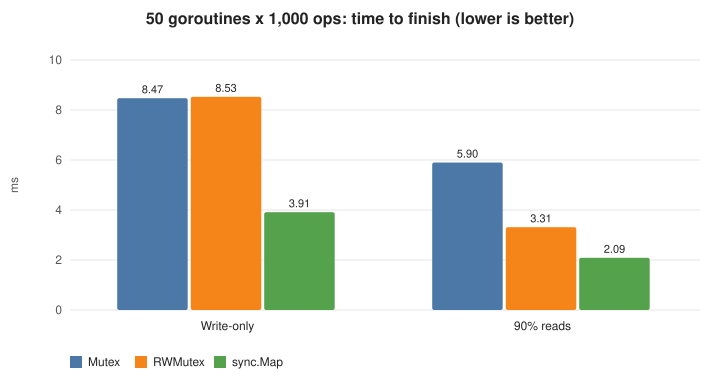


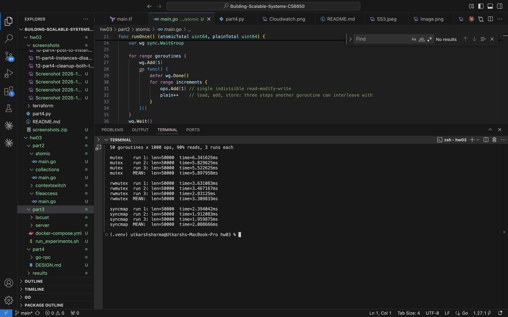

- **Mutex:** correct (`len=50000` every time) but slowest. Every operation waits for one global lock, so 50 goroutines on 8 cores spend most of their time queued, and the cache line holding the lock bounces between cores. **Lesson:** a lock buys correctness by turning parallel work back into serial work.
- **RWMutex:** for write-only it's no faster than Mutex (8.53 vs 8.47 ms), because every write still needs the exclusive `Lock()`. RWMutex is also slightly more expensive to manage, since it tracks a reader count. **Lesson:** RWMutex only helps when there are reads to share. With 90% reads it was **1.8× faster** than Mutex (3.31 vs 5.90 ms), because readers hold `RLock` concurrently.
- **sync.Map:** fastest in both cases, about 2.2× faster than Mutex for writes. Internally it isn't one lock around one map. It keeps a read-only map that is read without locks, plus a locked "dirty" map for new keys. Each goroutine here writes **disjoint keys** and never reads them back, which happens to be one of the two cases the docs say `sync.Map` is optimized for.

**Trade-offs:**

| | Pros | Cons |
|---|---|---|
| Mutex | simple, typed, works for any multi-step operation (check-then-insert, update two maps together) | everything is serialized |
| RWMutex | parallel reads, so it wins when reads dominate | no benefit for writes; writers can wait behind long readers |
| sync.Map | fastest for disjoint keys and read-mostly, write-once workloads | `any` values, so type assertions and boxing; no `Len()` (we had to `Range` to count); no atomic multi-key operations; slower than a locked map when the same keys are rewritten often |

**If reads dominate:** both RWMutex and sync.Map pull ahead of Mutex, as the 90% column shows. Real services are usually read-heavy, which is why Part III's server uses an RWMutex. Picking the structure depends on the **read/write mix and the key access pattern**, not on which one won a single benchmark.

### File access: `part2/fileaccess`

100,000 lines, mean of 3 runs:

| Mode | Time |
|---|---|
| Unbuffered (`f.Write` per line) | **168.6 ms** |
| Buffered (`bufio.Writer`, one `Flush`) | **10.0 ms**, which is **16.8× faster** |

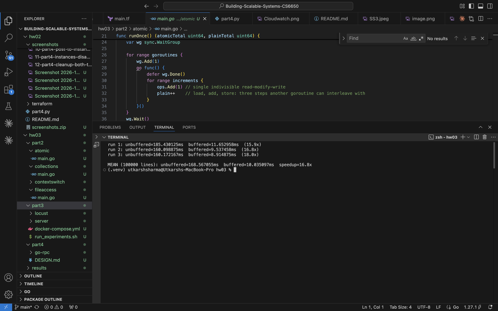

**Why:** each `f.Write` is a `write()` **system call**. The CPU switches from user mode to the kernel, the kernel copies about 12 bytes into the page cache, then switches back. That's 100,000 round trips. `bufio.Writer` copies lines into a 4 KiB buffer in user space and issues one syscall per 4 KiB, which is roughly 300 syscalls instead of 100,000. Neither version waits for the disk (no `fsync`), so the whole gap is the cost of crossing into the kernel.

**Trade-off:** buffering trades **durability for throughput**. If the process crashes before `Flush`, up to 4 KiB of "written" lines are lost. This shows up again in distributed systems: databases batch writes into a log and flush or fsync in groups, and the choice of when to fsync decides how much data a crash can lose.

### Context switching: `part2/contextswitch`

Two goroutines ping-pong an empty struct over an unbuffered channel 1,000,000 times. The average switch time is total ÷ (2 × round trips).

| | Avg switch (mean of 3) |
|---|---|
| `GOMAXPROCS(1)`, one OS thread | **105 ns** |
| `GOMAXPROCS(8)` | **120 ns** |

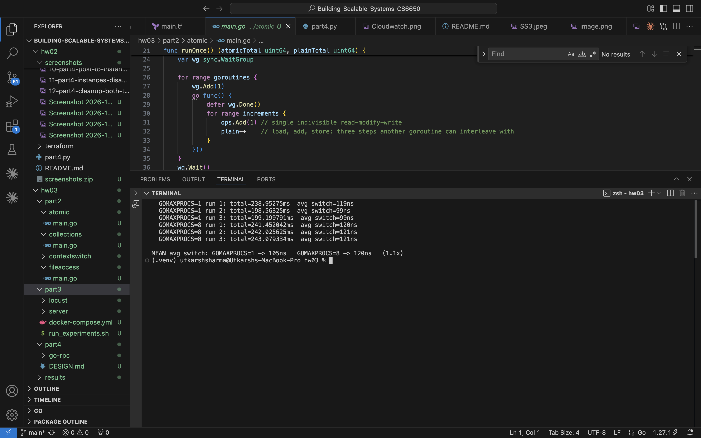

**The single thread is faster.** With one thread, a hand-off is just the Go scheduler parking one goroutine and running the other on the **same thread**: no kernel involvement, and the data stays in the same core's cache. With 8 threads, the two goroutines can sit on different cores. A hand-off then means waking a goroutine whose thread may be parked (an OS-level wakeup), and moving the channel's cache lines between cores. Parallelism doesn't help here because the work is strictly sequential: only one side can make progress at a time.

**Relating this to processes, containers and VMs** (roughly, cheapest to most expensive):

| Switch | Who does it | Approximate cost |
|---|---|---|
| goroutine → goroutine | Go runtime, user space | about 100 ns (measured) |
| OS thread → thread | kernel: save registers, scheduler | about 1–5 µs |
| process → process | kernel, plus an address-space switch with TLB and cache effects | several µs |
| container → container | the same as a process switch; containers are just processes with namespaces and cgroups | several µs |
| VM → VM | hypervisor: VM exit, saving the whole guest CPU state, and often an EPT/TLB flush | tens of µs |

The more state there is to save and the more isolation there is to cross, the more each switch costs. That's why Go uses cheap goroutines multiplexed onto a few threads, and why packing more containers onto a host is cheaper than packing more VMs.

---

## Part III: Locust load tests

The setup is in [`part3/`](part3):
- `server/main.go` is the HW2 albums server, with its slice replaced by a `map[string]album` behind a `sync.RWMutex`. The original appended to a shared slice from concurrent Gin handlers, which is the Part II race. GET by ID is O(1), and per-request logging is off.
- `locust/locustfile.py` uses `HttpUser` with tasks `GET /albums/{1,2,3}` at weight 3 and `POST /albums` at weight 1.
- `locust/locustfile_fast.py` is the same test using `FastHttpUser`.
- `docker-compose.yml` runs the albums server, a Locust master, and N Locust workers.

```bash
cd hw03/part3
docker compose up --build                                   # 1 worker, UI at localhost:8089
docker compose up --build --scale worker=4                  # 4 workers
LOCUSTFILE=locustfile_fast.py docker compose up --build --scale worker=4
```

None of the runs below had any failures.

### 1 worker, 1 user: GET vs POST

| | Requests | Median | p95 | p99 | Avg | Avg size |
|---|---|---|---|---|---|---|
| GET `/albums/[id]` | 254,497 | 0.25 ms | <1 | 1 | 0.35 ms | 75.6 B |
| POST `/albums` | 84,713 | 0.28 ms | <1 | 1 | 0.37 ms | 92.8 B |

That's 2,712 RPS total, with 0 failures.


**GET vs POST:** the request counts are 3:1, as designed. POST is consistently a little slower (median 0.28 vs 0.25 ms) and its response is larger. A POST has to:
1. send a JSON body that the server must read and parse (`BindJSON`, which uses reflection),
2. take the **exclusive** write lock, so it waits for all in-flight readers,
3. insert into the map, which sometimes grows it, then echo the album back.

A GET only takes a shared `RLock` and does a map lookup. The gap is small because the store is tiny and the machine is local. With a real database it would widen, since a write would also hit disk, indexes or replicas.

**Which operations dominate in the real world?** Reads. An album store is browsed far more than it's updated; 3:1 is conservative, and 10:1 or 100:1 is typical. That's why the server uses a hash map, for O(1) GET by ID instead of the original slice scan, under an RWMutex so that the common case (reads) runs in parallel. Part II showed RWMutex is 1.8× faster than Mutex at 90% reads and no better for writes. A write-heavy store would point toward sharded locks or sync.Map instead.

### 1 worker, 50 users, ramp 10/s, GET:POST 3:1

| | Median | p95 | p99 | Avg |
|---|---|---|---|---|
| GET | 8 ms | 10 ms | 13 ms | 8.03 ms |
| POST | 8 ms | 10 ms | 13 ms | 8.06 ms |

That's **4,238 RPS**, with 0 failures.


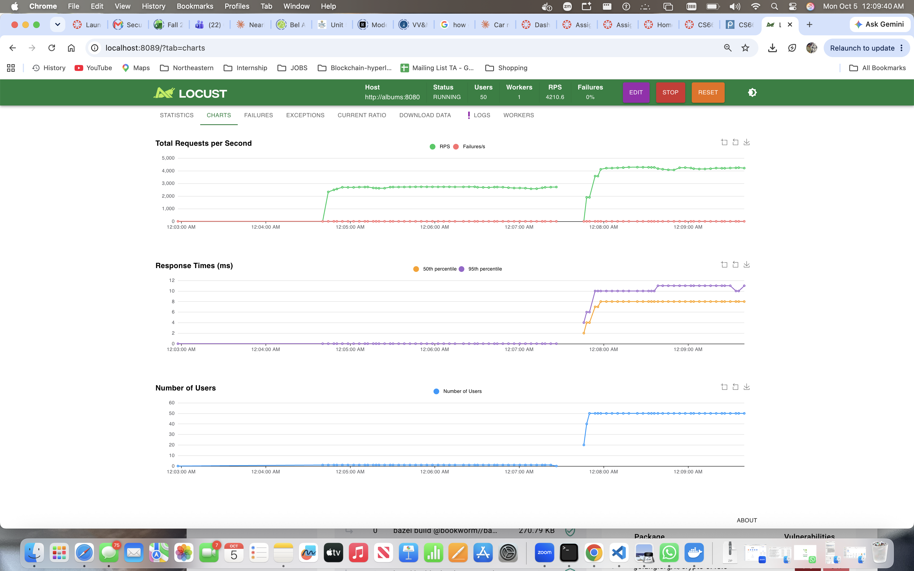

Going from 1 to 50 users raised RPS only **1.56×** (2,712 → 4,238), while latency went **32× higher** (0.25 → 8 ms). Little's Law: 50 users ÷ 4,238 RPS ≈ 11.8 ms per request cycle. The server isn't the problem here. The **single Locust worker hit its CPU limit**, and Locust logged it:

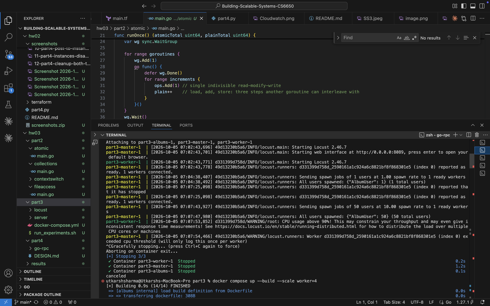

A Locust worker is one Python process: one core, the GIL, and gevent green threads. Fifty green threads take turns on one core, so most of the measured 8 ms is time each simulated user spends waiting for the worker to schedule it, not server time.

### Amdahl's Law: 4 workers

| | Median | p95 | p99 | Avg | RPS |
|---|---|---|---|---|---|
| GET | 2 ms | 5 ms | 6 ms | 2.62 ms | |
| POST | 3 ms | 5 ms | 6 ms | 2.74 ms | |
| **Total** | | | | | **11,788** |


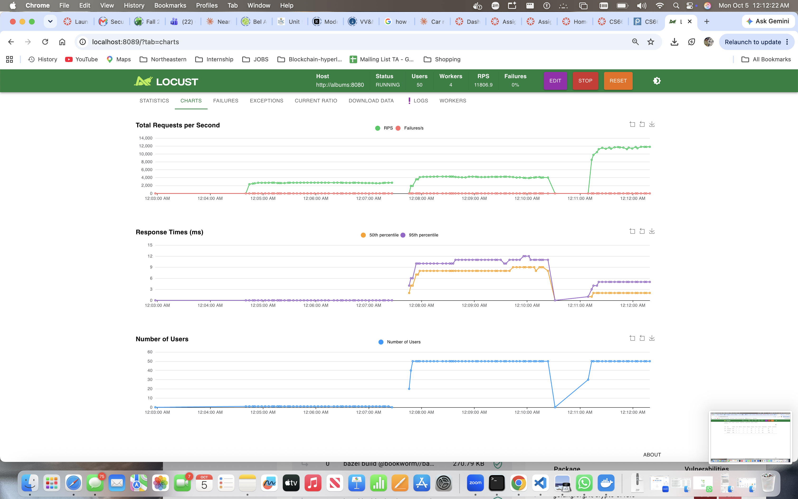


4× the workers gave **2.78×** the throughput, not 4×. Solving Amdahl's Law, S = 1 / ((1−p) + p/N), with S = 2.78 and N = 4 gives p ≈ 0.85. In other words, about 15% of the work behaved as if it were serial.

`docker stats` during this run shows where it went:

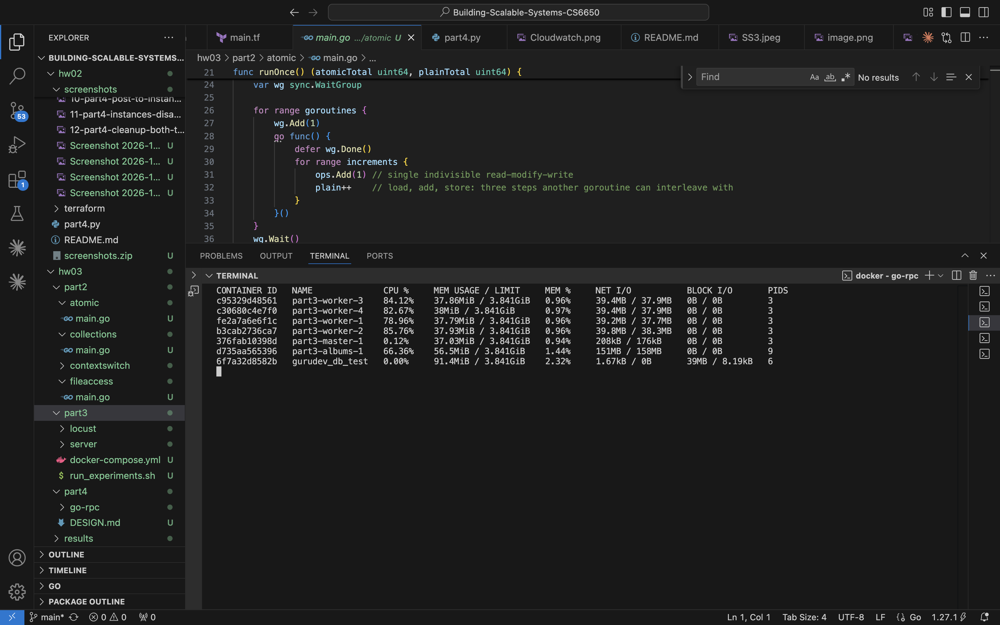

| Container | CPU |
|---|---|
| worker-1…4 | 79%, 86%, 84%, 83% |
| albums server | 66% |
| master | 0.1% |

That's about 400% in total on a **4-CPU Docker VM**, so the machine was fully saturated. Load generators and the server under test compete for the same 4 cores, so each added worker takes CPU away from the server it's measuring. That's the main reason for the sub-linear speedup.

**Does the hashmap contribute?** Yes, it's the true serial fraction inside the server. Every POST takes the RWMutex's exclusive lock, so 25% of requests run one at a time, and all GETs that arrive meanwhile wait behind the writer. GETs on the same three keys also contend on the lock's reader counter, a cache line bouncing between cores. The lock is held for well under a microsecond, so at this scale it's a small part of the 15%. But it's the part that **can't** be fixed by adding cores. Fixing it would mean fewer writes, sharding the map, or splitting reads from writes (copy-on-write snapshots, replicas).

### Context switching: FastHttpUser

| | 1 worker | 4 workers |
|---|---|---|
| HttpUser RPS | 4,238 | 11,788 |
| **FastHttpUser RPS** | **13,118** (3.1×) | **41,138** (3.5×) |
| FastHttpUser median / p95 / p99 | 2 / 4 / 6 ms | 1 / 2 / 11 ms |

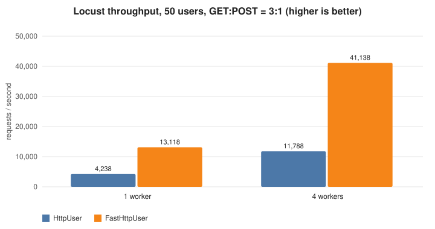


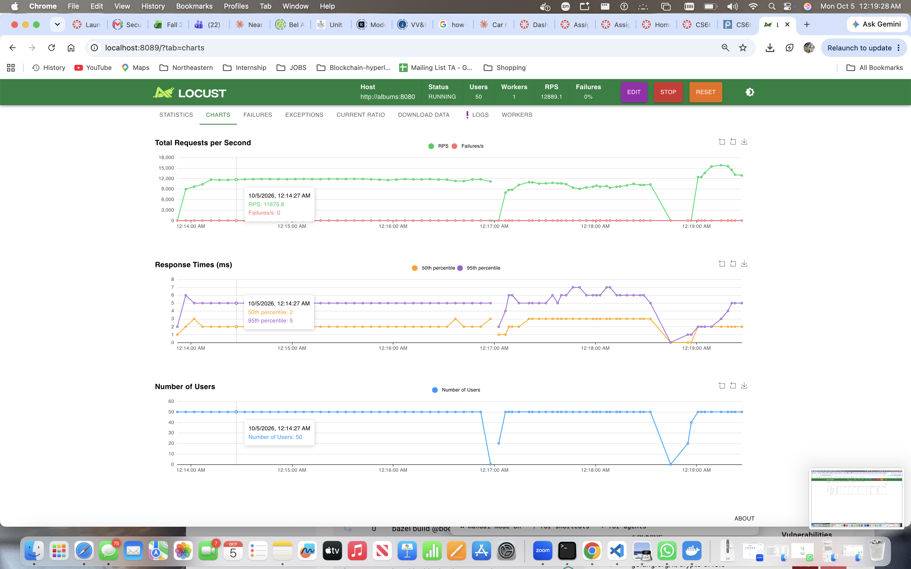

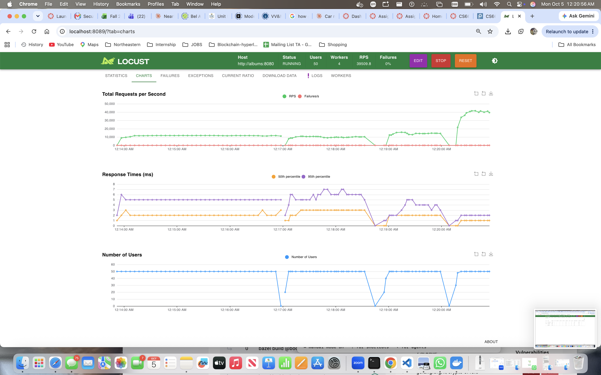

A single FastHttpUser worker beat **four** HttpUser workers (13,118 vs 11,788 RPS), still with 0 failures.

**Why:** `HttpUser` uses `python-requests`, which is pure Python. Each request builds `Session`, `PreparedRequest` and `Response` objects, runs header dicts, cookie jars and hooks, and goes through `urllib3`'s connection pool. That's a lot of interpreted Python per request, so a worker spends more CPU per request than the Go server does serving it. `FastHttpUser` uses `geventhttpclient`, whose HTTP parsing is in C and which does far less per-request allocation, so each request costs a fraction of the CPU.

How this ties to context switching: Locust users are gevent **green threads**, user-level coroutines that switch cooperatively when they block on a socket, like goroutines in Part II. That switch is cheap. The overhead is everything a user does **between** switches. FastHttpUser shortens that work, so the same core can cycle through many more users per second. It also gives up the GIL less, since there's less Python to run.

With 4 FastHttpUser workers, p99 rose to 11 ms while the median fell to 1 ms. At 41k RPS the **server** becomes the contended resource (4 CPUs shared with 4 busy workers), and the tail shows it first.

**Takeaway:** a load test measures the **whole system, including the load generator**. Our first HttpUser results mostly measured Locust. You need to check the generator's CPU (`docker stats`, Locust's CPU warning) before believing any latency number, and ideally run the generator on a different machine from the server.

---

## Part IV: Concurrent server design

The full write-up is in **[`part4/DESIGN.md`](part4/DESIGN.md)**. The provided code is unchanged in `part4/go-rpc/`.

**Why the server is not scalable:** `main` calls `ln.Accept()` **once** and handles that client on the main goroutine.

- When the client sends CLOSE, the **process exits**:

  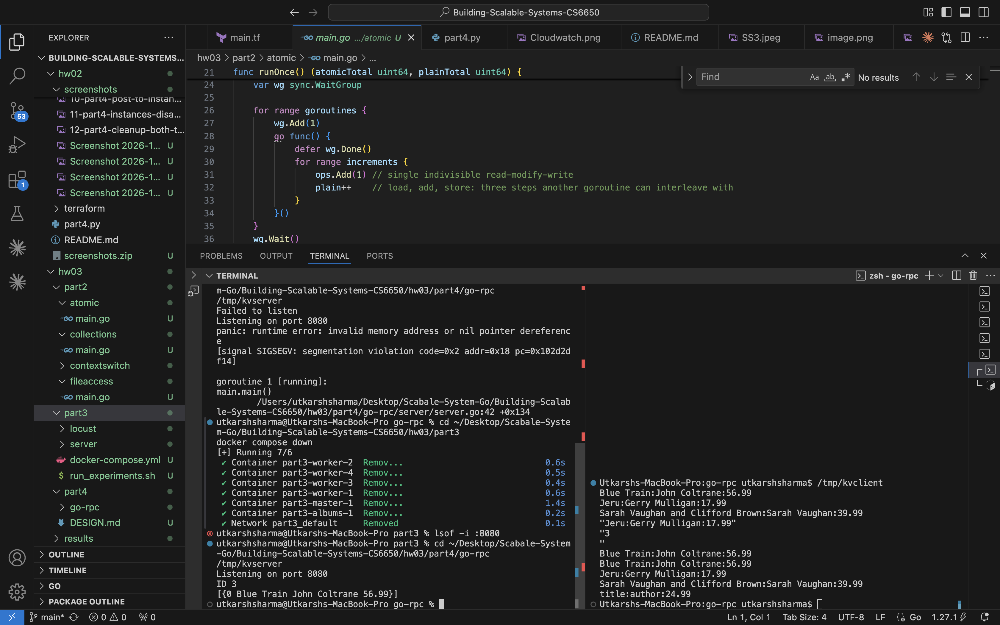

- A second client can connect (the kernel backlog accepts it) but is never served. Its `DUMP` gets no reply:

  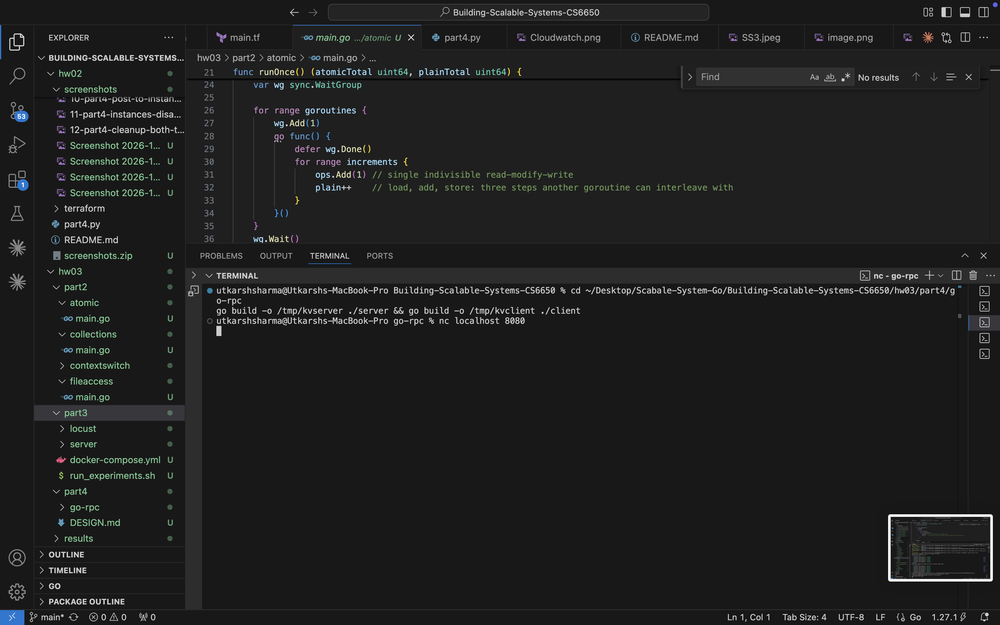

- Protocol bugs found during the walkthrough also crash the server for everyone. `GET 99` sends the error reply, then dereferences a nil `*Album` because there's no `return`:

  
  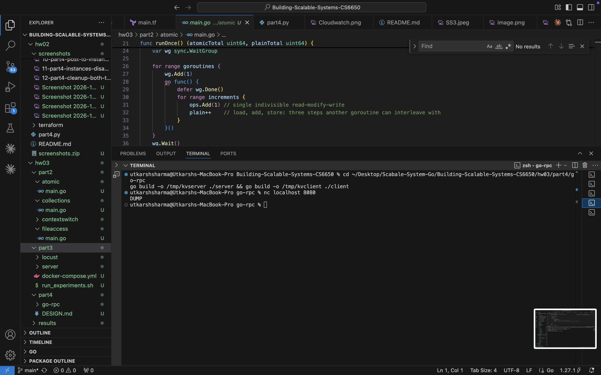

- `net.Listen` errors are printed and then ignored. With the port in use, the server prints "Listening on port 8080" and then panics. The `-port` flag is parsed but never used:

  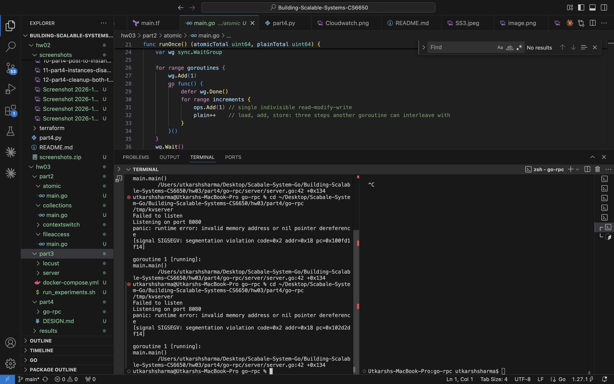
  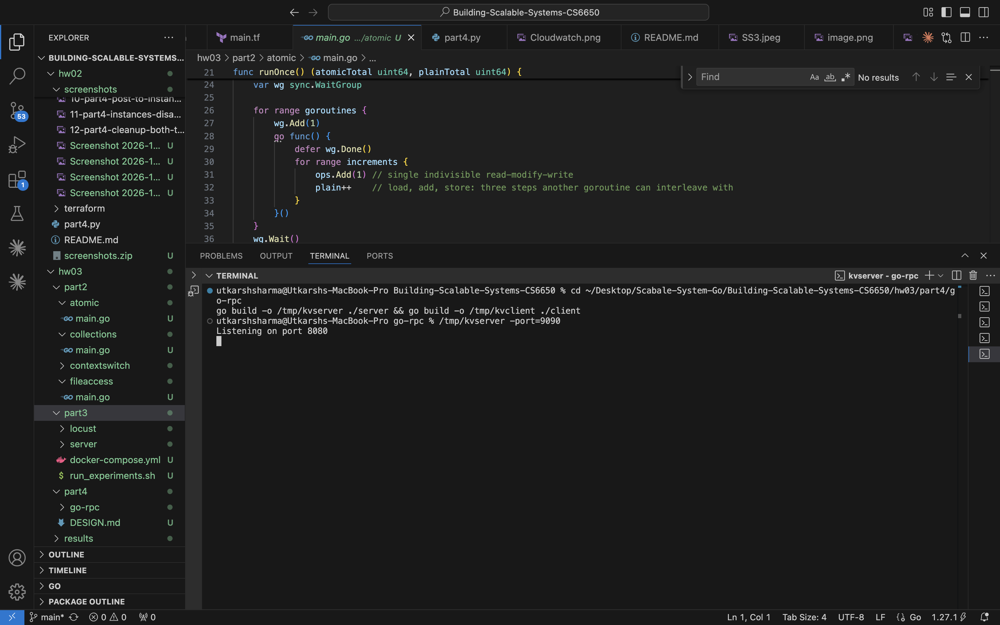

**Proposed design, in summary:**
- **Connections:** one goroutine per connection, bounded by a semaphore. Each gets a `recover()` so a bad request kills only its own session, and read/write deadlines drop idle or slow clients.
- **Data types:** `Album` is unchanged. The *storage* changes: the global slice becomes a `Store` with an `RWMutex`, a slice indexed by ID (O(1) GET), and a `map[title|artist|price]id` (O(1) STORE dedupe). Dedupe and ID assignment happen atomically under one `Lock`.
- **Never hold the lock during network I/O:** DUMP and SEARCH copy under `RLock`, release it, then stream to the client.
- **Scaling:** reads run in parallel, while writes are serialized. The write lock is the Amdahl serial fraction from Part III, and backpressure from the connection cap keeps throughput flat instead of collapsing.
- **Starvation:** each client has its own goroutine; Go's scheduler is preemptive; Go's RWMutex blocks new readers once a writer waits; and slow readers only delay themselves.
- **Worst case:** a huge store combined with many concurrent DUMP/SEARCH requests (O(n) copies, writers queuing behind long `RLock`s). The fix is lock-free copy-on-write snapshots (`atomic.Pointer`), paging, and an inverted index for SEARCH. Write bursts are handled by sharding the store, and connection floods by caps and deadlines.

---

## What I learned

| Concept | Evidence |
|---|---|
| Unsynchronized read-modify-write loses updates | plain counter off by 30k–38k in 10/10 runs; `-race` points at the line |
| Go maps fail fast under concurrent writes | `fatal error: concurrent map writes`, 3/3 runs |
| Locks give correctness at the cost of parallelism; the right primitive depends on the read/write mix | Mutex = RWMutex for writes; RWMutex 1.8× faster at 90% reads; sync.Map fastest for disjoint keys |
| Crossing into the kernel is expensive; batching amortizes it but risks data loss | buffered writes 16.8× faster |
| Lighter-weight switches are cheaper | goroutine switch about 100 ns; it got slower when spread across OS threads |
| Speedup is sub-linear (Amdahl), and the load generator is part of the system | 4 workers → 2.78×; Docker CPUs saturated; FastHttpUser gave 3.1–3.5× |
| A server that handles one client at a time doesn't scale, and one bug can take down every client | go-rpc demos above |
